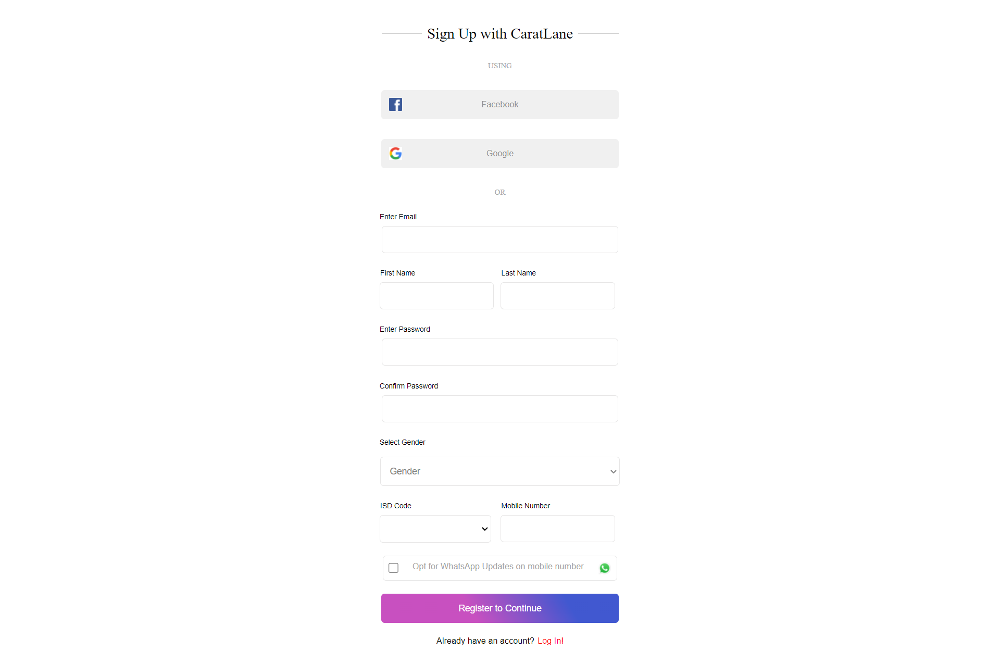
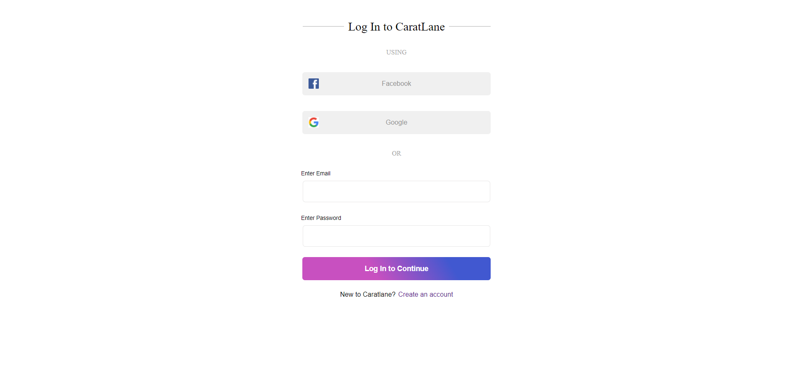
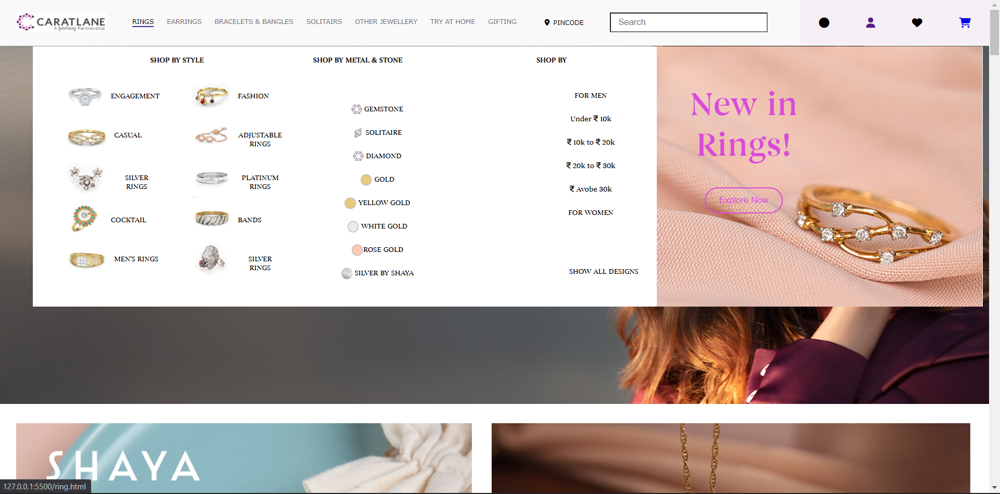
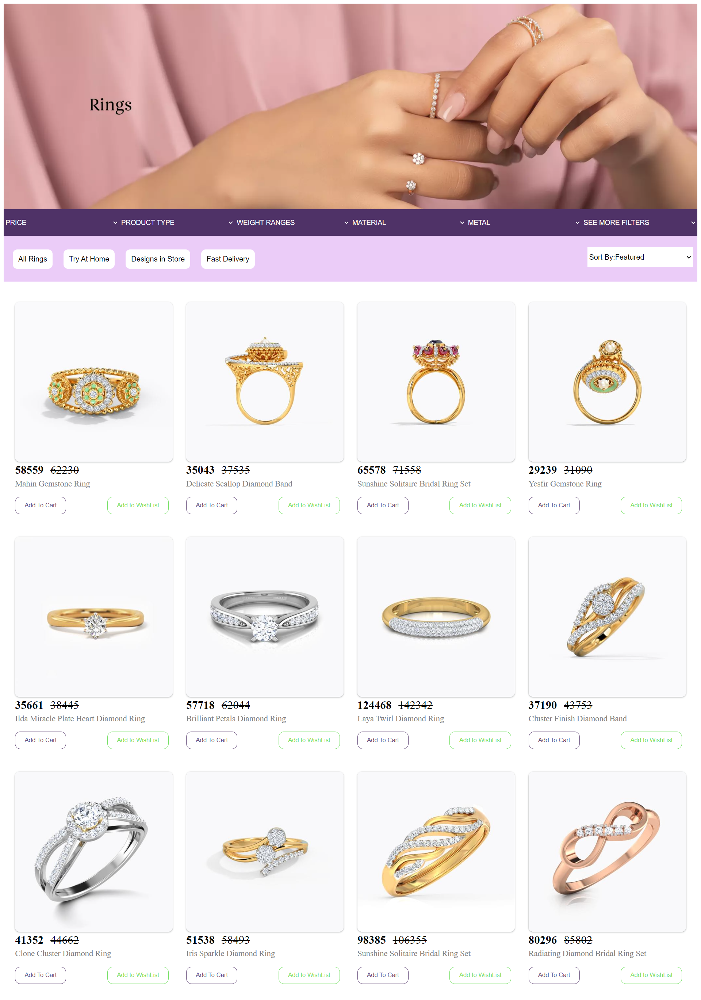
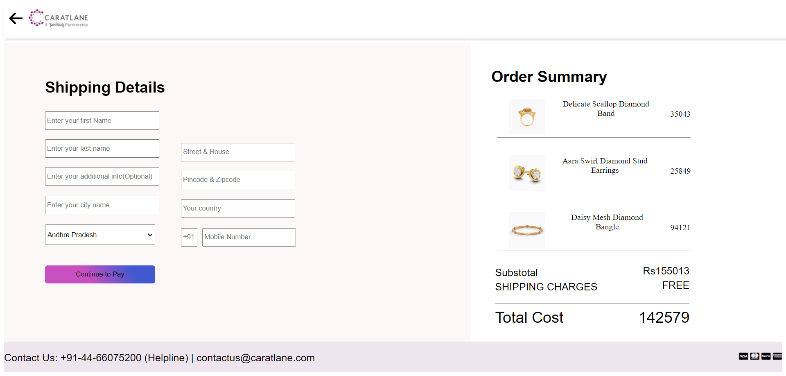

# CaratLane

CaratLane was founded in 2008, with the objective to make beautiful jewellery accessible, affordable and forever wearable. After speaking to hundreds of women across the country, we came to find that there was a common dilemma women faced - picking between expensive jewellery for special occasions, and everyday jewellery that was of inferior quality and was not keeping pace with their changing lifestyle. CaratLane was founded, to give women access to modern, fine jewellery, that was also wearable everyday.
Today CaratLane is India's largest omni-channel jeweller. CaratLane also has over 123 retail stores across 40+ Indian cities.

# CaratLane CLone

This is the clone of caratlane.com which we have done during our Unit 2 construct week at Masai. We made this clone functional. 
## Technologies used

- HTML
- CSS
- Javascript

## Functional things

- User signup page and login page with data stored in local storage.
- Home page
- 3 product pages
- Sorting functionality
- Add to cart button
- Checkout page with cart updation 
- Payment page with payment confirmation


## Run Locally

Pre-Requisite : 
VS Code

Clone the project

```bash
  https://github.com/Shubham-46/CARAT-LANE-CLONE.git
```


## Website Flow

- Signup and Login page by Aakarsh



- Homepage by Aakarsh and Sumangal



- Product pages by ratnesh and Saikiran


- Checkout and Payment pages by Shubham




## Authors

- Aakarsh
- Sumangal Dey
- Shubham Mishra
- Ratnesh Kumar
- Jogi Saikiran

## CaratLane Clone Blog link

[CLick here for the Blog link](https://medium.com/@aakarsh604/caratlane-website-cloning-466ea06a68c4)

